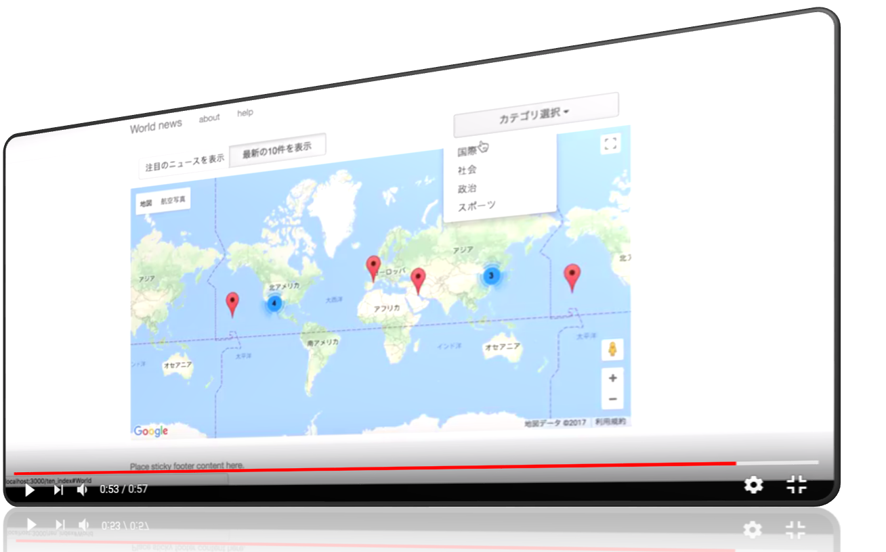

# NEWS×MAP（プロダクト名）
### サイトURL: http://54.249.93.130/

## 製品概要
### ニュース地図 × Tech
一体、どこで何が起きているのだろうと疑問を抱いたことはありませんか？

### 背景（製品開発のきっかけ、課題等）

製品の企画で議論を始める際に、話し合いのぶれない軸を定めるためには、開発テーマの決定が最重要だと考えられます。しかし、新しい社会問題、あるいは斬新な解決策を考慮して、立案する手がかりをつかむのは最も難しいです。そこで、**新しい問題に気付けるキッカケ作りのツールが欲しい**と願い、具体的に学生が大学のレポートや研究等で重要なテーマを決めるためには、どうしたら良いのかと考えたことが、本製品を開発するきっかけとなりました。

* 「新しい情報をいつでも・どこでも・手軽に入手したい」と一度は皆さん思った経験があるのではないでしょうか？

ニュースアプリを携帯やPCに追加して、WEBニュースを積極的に閲覧するようになった経験があるのではないかと思われます。
しかしながら、忙しかったり疲れていたりすると、ついつい閲覧する機会が減ってしまいます。そこで、顧客を**学生**に着目した時に2つの課題や現状が考えられました。

* 第1に、学生の**意識が低い**
  
2016年6月中旬から選挙法の改正により投票の年齢は「20歳以上の男女」から「18歳以上の男女」へ変更されました。
選挙権の年齢が引き下がった一方で、若者の投票率はどの世代よりも低く、若者の政治離れが懸念されています。
そんな若者に我々は世界や政治を身近に感じて頂きたいのです。
  
* 第2に、学生の**視野が狭い**

「最近の若者は視野が狭くなっている」という大人の意見が世間から見た若者の現状です。
「自分の無知を恥じることなく、知らない情報は自分には関係ない」と捉えているからです。
そんな若者の傾向の1つは、
「広い世界を見渡すと、自分がちっぽけで無力に感じてしまい、自分が傷つかないように、外の世界との繋がりを避けている」
ように思われ、若者はどうしても自分の興味や関係のあるものだけに目を向けてしまいます。

* 第3に、学生は**他人に無関心**

以上の結果、若者は自然に他人への配慮を考えなくなり、視野の狭さを促進させているように見られます。
自分の小さなコミュニティの中だけに満足せず、ニュースを世界規模で見れるようになると視野を広げるきっかけになると考えました。
また、視野を広げることは新たなイノベーションに繋げられるのではないでしょうか。

### 製品説明（具体的な製品の説明）

実装した機能は以下の3つです。

* 地図上は直近の最新ニュース記事を数十件のみ配置
* 各ニュース内容は要約して表示
* リンクからニュースのソース元である詳細に飛ぶ選択が可能

従来の既存製品があるかどうか調査すると、企業利益が目的ではなく、地方の面白いニュースの発信を目指す「みんなの経済新聞」で使用されている[ニュース地図](https://minkei.net/map.html)と呼ばれる製品が存在したが、次のような問題点が残されていました。

* 地域の話題性が中心となり、社会問題に焦点が当たっていない点
* 情報が日本に集中してしまっていて、世界単位での情報収集ができない点
* 場所は地域に限られていて、国や都市での問題でニュース同士の関連性が見出せない点
* 記事の見出しは、一目で内容が理解できない点
* 地域ごとの地図しか見れず、世界の全体像が把握できない点

以上の課題を解決して、我々は最近の若者の傾向が改善されるように務めたいと願いを込め、本製品を開発しました。

### 特長

#### 1. 世界の新しい社会問題が浮き彫りに！
* 世界規模で社会問題に焦点を当て、国や都市での問題をピックアップする事で他国との関連性を見出して視野の拡大を促します

#### 2. デザインが頭に突き刺さる衝撃！
* 世界地図の全体像を一面で魅了する事で見やすさに加えて、顧客の好奇心を掻き立てます

#### 3. ニュースの内容が一目で理解！
* ニュース記事の問題点を要約して表示する事で、一目で困っている具体的な内容が簡単に理解されます

### 解決出来ること
* 本開発の成果は、学生の意欲増進、社会貢献や**新たなイノベーターへの動機作り**が期待されます

### 今後の展望
今回はパッと見って分かるデザイン性の追求が実現できなかったのが最も残念に思われますが、
今後は次のような機能を追加すると更にサービスが改善される予定です。
* キーワードでニュースの抽出
* ニュースの優先順位付けの増加
  * 閲覧数の多さ順で表示
  * 類似する問題を扱う記事の多さ順で表示
* 表示する記事の期間の指定選択肢

加えて、以下のように展開していけば非常に良い成果が期待されると想定されます。
* 1つの記事データベースだけではなく、複数のデータベースから記事の取得
* 複数の記事の関連性を視覚化
* 人々に注目されずに**埋もれている新しい社会問題を機械学習で推定**

## 開発内容・開発技術
### 活用した技術
#### API・データ
* [文章要約API(sdon)](http://www.47news.jp/cgi-bin/ra/editor/editor.cgi)
* [Google News 取得API](http://tomehachi.sakura.ne.jp/blog/archives/486)
* [Google地図API](https://developers.google.com/maps/?hl=ja)

#### フレームワーク・ライブラリ・モジュール
* サーバ: Amazon Web Services
  * Rack Webサーバー: Unicorn
  * Webサーバー: Nginx
  * フレームワーク: Rails
* Ruby on Rails
  * Ruby: v2.4.0
  * Rails: v5.1.4
* DB: MySQL2

#### デバイス
* Webアプリケーション

### 研究内容・事前開発プロダクト

* 野口健斗(東海大学理学部情報数理学科4年)：プロジェクトマネージャ

私は教育産業に貢献したいと考え、[「子どもの学習支援」](http://www.city.hadano.kanagawa.jp/www/contents/1001000002773/index.html)を行い、特に外国人や生活保護受給者世帯の居場所づくりに力を入れています。また、研究は学部3年時に「Pythonを用いた強化学習に関する調査」から開始しました。さらに、現在は「人狼知能プロジェクトにおける相手の思考モデルを考慮した対話エージェントの試作」という卒業研究をさせて頂いています。

* 下条拓海(東京工業大学大学院1年)：サーバーサイドエンジニア

研究は脳波に関することです。

* 山田恭也(東京理科大学3年)：ビデオエディタ

趣味は競技プログラミングです。

* 松田美津紀(日本体育大学1年)：チーフエディタ

趣味は競技スキーです。

* 青柳貴士(電気通信大学大学院1年)：テクニカルアドバイザ

研究は自然言語処理に関することです。

### 独自開発技術（Hack Dayで開発したもの）
#### 2日間に開発した独自の機能・技術
独自で開発したものは、様々な個人メンバーによる短期開発をスムーズに促進させるため、情報共有で意見交換し易い次のような3つのテンプレート（テンプレ）です。

**自己紹介テンプレ**
* 所属/氏名：
* 開発したいもの/理由：
* 目的/その他：

**自己PRテンプレ**
* 短所/長所：
* 経験/近況：
* 得意分野/その他：

**開発テーマ提案テンプレ**
* X-Tech/実際に利用される方：
* 明確な問題点/原因：
* 解決できる機能/その他：

